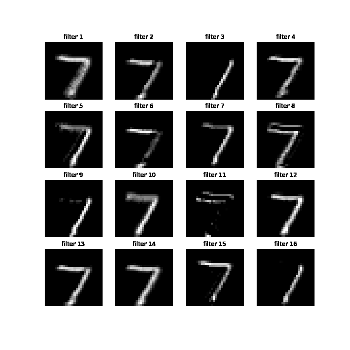

# Visualization

모델 학습 과정을 시각화하여 학습 과정에 대한 이해와 XAI를 실현합니다.


먼저 CNN 학습 과정을 시각화합니다.

```bash
python cnn_visualization.py (아직 없는건 함정..)
```


|       | Conv1               | Conv2               |
| ----- | ------------------- | ------------------- |
| MNIST |  |  |


