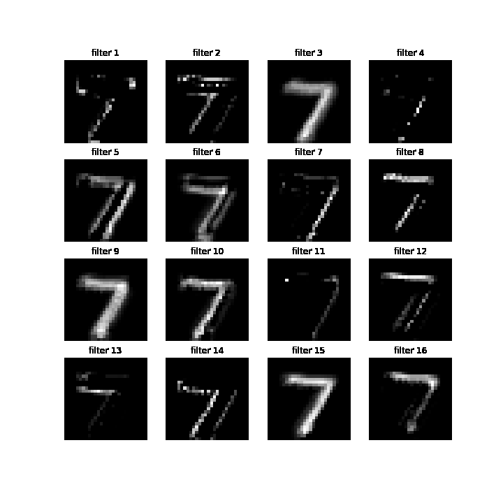

# Visualization

모델 학습 과정을 시각화하여 학습 과정에 대한 이해와 XAI를 실현합니다.


먼저 CNN 학습 과정을 시각화합니다.

```bash
python cnn_visualization.py (아직 없는건 함정..)
```


|       | Model                                                        | Conv1               | Conv2               |
| ----- | ------------------------------------------------------------ | ------------------- | ------------------- |
| MNIST | Model: "sequential"<br/>_________________________________________________________________<br/>Layer (type)                 Output Shape              Param #   <br/>=================================================================<br/>conv2d (Conv2D)              (None, 28, 28, 16)        144       <br/>_________________________________________________________________<br/>conv2d_1 (Conv2D)            (None, 28, 28, 16)        2304      <br/>_________________________________________________________________<br/>flatten (Flatten)            (None, 12544)             0         <br/>_________________________________________________________________<br/>dense (Dense)                (None, 100)               1254500   <br/>_________________________________________________________________<br/>dense_1 (Dense)              (None, 10)                1010      <br/>=================================================================<br/>Total params: 1,257,958<br/>Trainable params: 1,257,958<br/>Non-trainable params: 0 |  |  |


